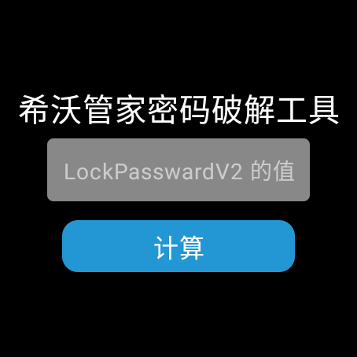

# 希沃管家密码破解工具

希沃管家密码破解工具是一个用Kotlin和Jetpack Compose编写的软件，旨在帮助破解希沃管家的密码。该项目的灵感和部分代码来自于[Seewo Assistant Password Recovery Tool V2](https://github.com/zhy8388608/Seewo_Assistant_Password_Recovery_Tool_V2)

## 使用方法

1. 从你的电脑中找到`LockPasswardV2`的值。该值通常位于以下路径之一：
   - `C:\ProgramData\Seewo\SeewoCore\SeewoCore.ini`
   - `%APPDATA%\Seewo\SeewoAbility\SeewoLockConfig.ini`
2. 打开对应的`.ini`文件，找到`LockPasswardV2`或`PASSWORDV2`字段，并记录其值。
3. 将记录的`LockPasswardV2`或`PASSWORDV2`值粘贴到软件的输入框中。
4. 点击“计算”按钮，软件将开始计算密码（该过程可能需要5分钟以内的时间）。

## 技术栈

- **Kotlin**：强大的编程语言，用于编写应用逻辑。
- **Jetpack Compose**：现代化的UI工具包，用于构建响应式用户界面。

## 构建

1. 克隆仓库：
    ```bash
    git clone https://github.com/gohj99/seewoaprt.git
    ```
2. 打开项目并构建：
    ```bash
    cd gohj99
    ./gradlew build
    ```
3. 运行应用：
    ```bash
    ./gradlew run
    ```

## 截图



## 贡献

欢迎任何形式的贡献！如果你有任何建议或发现了问题，请提交一个issue或者创建一个pull request。

## 许可证

本项目遵循 [GPL-3.0](LICENSE)。

## 致谢

特别感谢[zhy8388608](https://github.com/zhy8388608)的[Seewo Assistant Password Recovery Tool V2](https://github.com/zhy8388608/Seewo_Assistant_Password_Recovery_Tool_V2)项目。
